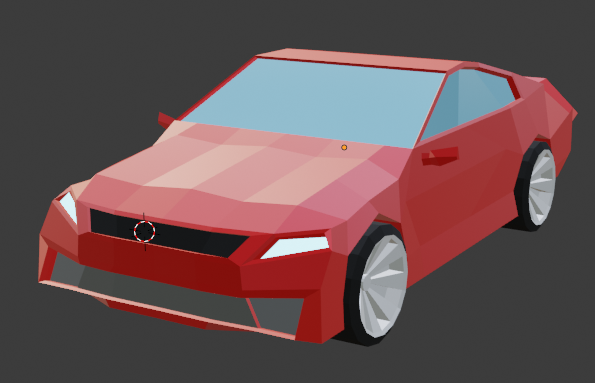
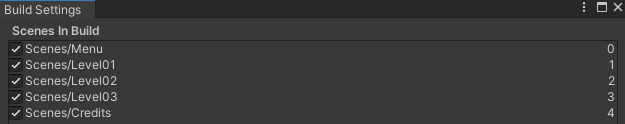
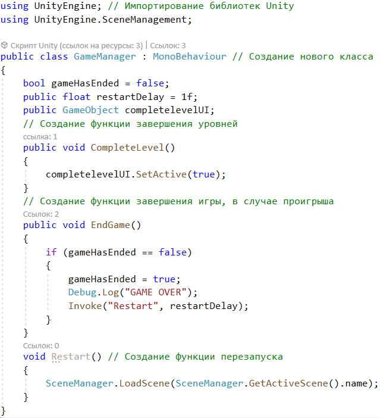
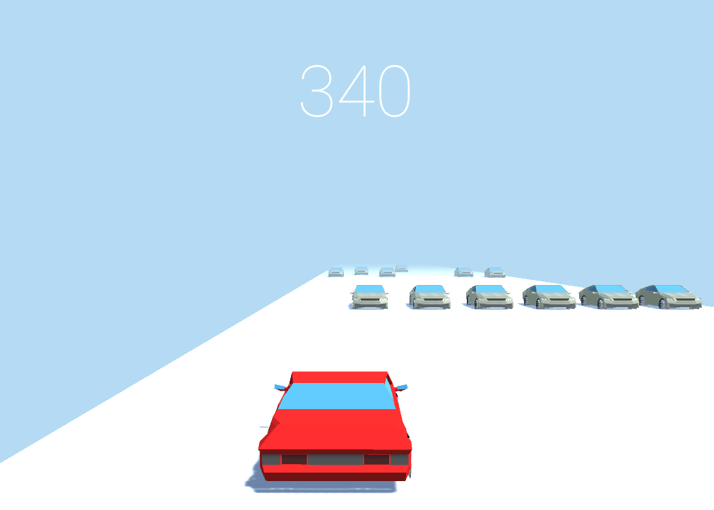
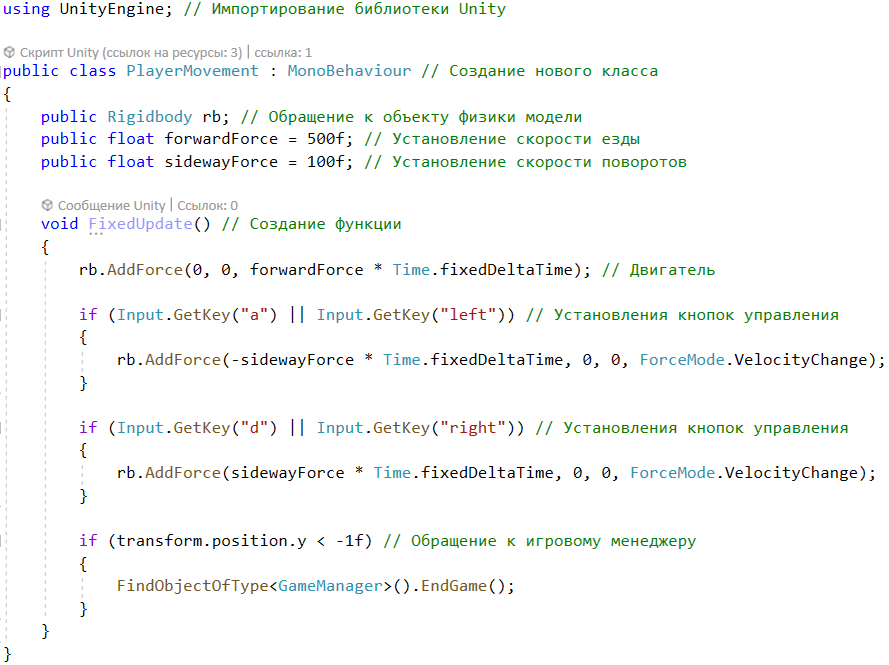

## Legend About Racer Game

  

As the user opens the _.exe__ file he sees the loading scene    
As it was said, there are 3 levels of the game, for that reason it was created a game manager    
Here is the C# code for the game manager:    
Game process:    
Code for the player's maneuvering actions:    
And after the game is finished, the credits scene is loaded:  
